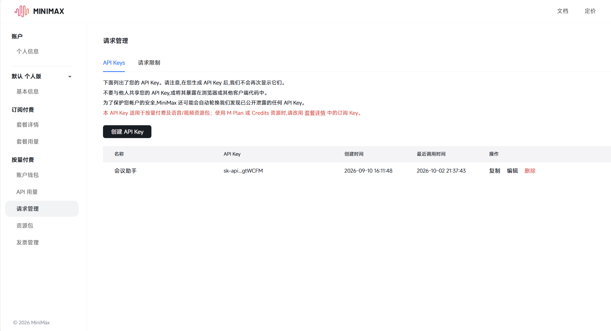
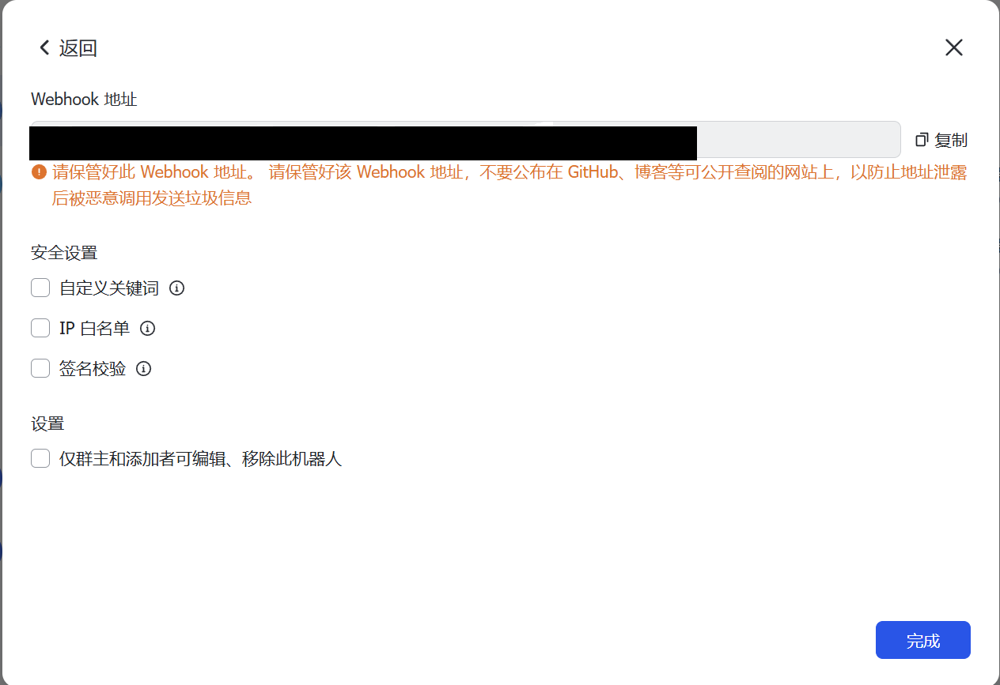

1.MiniMax LLM
    前往[ MiniMax 开放平台](https://platform.minimax.cn/console/access)创建一个MiniMax API，填入.env中的MINIMAX_API_KEY=
    

2.飞书机器人
    前往[飞书开放平台](https://open.feishu.cn/) 点击开发者后台，创建一个企业自建应用
    获取`FEISHU_APP_ID` 和`FEISHU_APP_SECRET`
    
    下载飞书，创建一个群聊，在设置->群机器人->添加机器人中搜索之前创建的企业自建应用并添加
    或者在创建的群聊中，在设置->群机器人->添加机器人->自定义机器人中添加获得FEISHU_WEBHOOK_URL
    